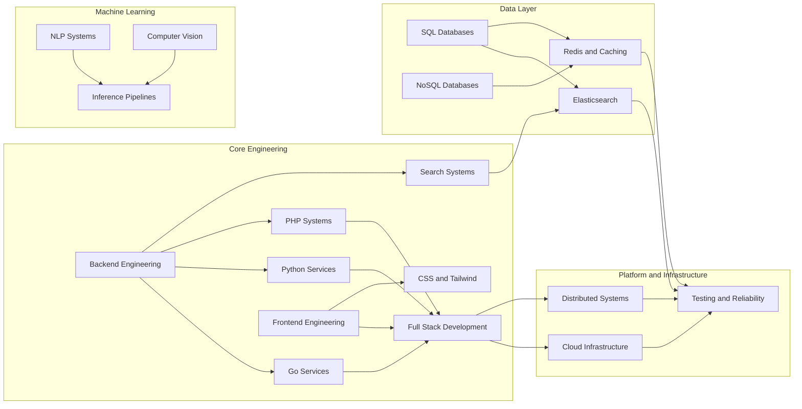

  

<h2>Software Engineer | Founder | Backend, Full Stack, Machine Learning</h2>

 

  

---

## About me

I am a software engineer and founder who enjoys building products across backend systems, modern web apps, machine learning, search infrastructure, databases, and cloud platforms.

I care about software that is fast, scalable, cleanly designed, and reliable in production.

---

## Focus areas

<table align="center">
  <tr>
    <td width="50%" valign="top">

### ⚙️ Backend Engineering

<table>
  <tr><td>🚀 API design and service architecture</td></tr>
  <tr><td>⚡ Concurrency, caching, and search systems</td></tr>
  <tr><td>🧩 Performance-focused backend services</td></tr>
</table>

</td>
<td width="50%" valign="top">

### 🖥️ Frontend and Full Stack

<table>
  <tr><td>🎨 Interactive web applications</td></tr>
  <tr><td>🛠️ End-to-end product development</td></tr>
  <tr><td>✨ Clean UI with practical engineering</td></tr>
</table>

</td>
  </tr>

  <tr>
    <td width="50%" valign="top">

### 🗄️ Databases and Data Systems

<table>
  <tr><td>🧱 Relational and document-based data modeling</td></tr>
  <tr><td>📚 Query design, indexing, and data access patterns</td></tr>
  <tr><td>🔎 Search-aware and performance-conscious storage systems</td></tr>
</table>

</td>
<td width="50%" valign="top">

### 🤖 Machine Learning

<table>
  <tr><td>🧠 Computer vision and NLP systems</td></tr>
  <tr><td>📡 Real-time inference pipelines</td></tr>
  <tr><td>📈 Model evaluation and optimization</td></tr>
</table>

</td>
  </tr>

  <tr>
    <td width="50%" valign="top">

### ☁️ Cloud and Infrastructure

<table>
  <tr><td>☁️ Cloud-native deployment</td></tr>
  <tr><td>📊 Scalable infrastructure and observability</td></tr>
  <tr><td>🔧 Reliability, automation, and DevOps</td></tr>
</table>

</td>
<td width="50%" valign="top">

### 🧭 Engineering Style

<table>
  <tr><td>🏗️ Systems thinking across product and infrastructure</td></tr>
  <tr><td>📐 Clean architecture with practical tradeoffs</td></tr>
  <tr><td>🚀 Fast execution without sacrificing reliability</td></tr>
</table>

</td>
  </tr>
</table>

---

## Engineering map

---

## Current interests

- Backend systems and distributed services
- Full stack product engineering
- Machine learning and real-time inference
- Search, retrieval, and data-intensive systems
- Databases, caching, and performance optimization
- Cloud infrastructure and developer tooling

---

## Connect

  
  
  

